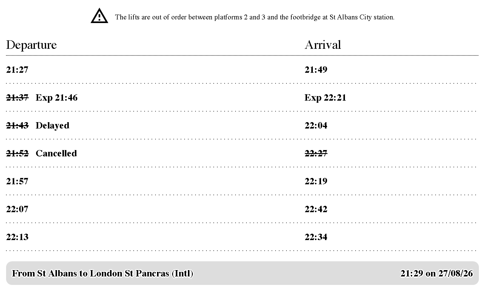
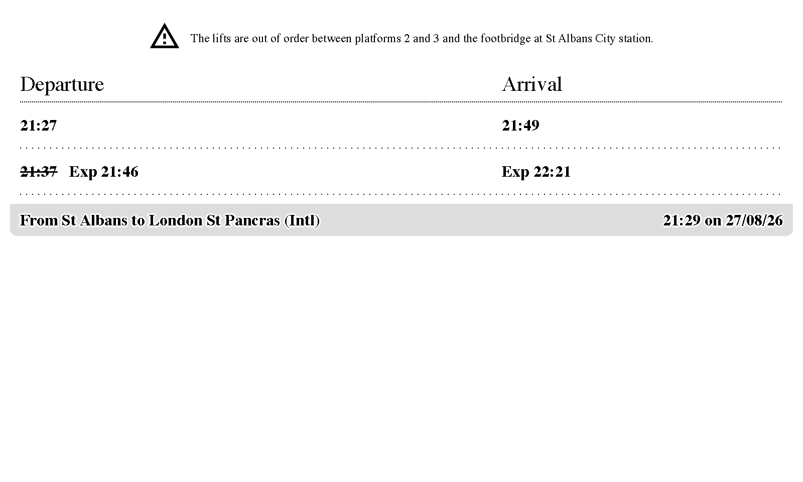
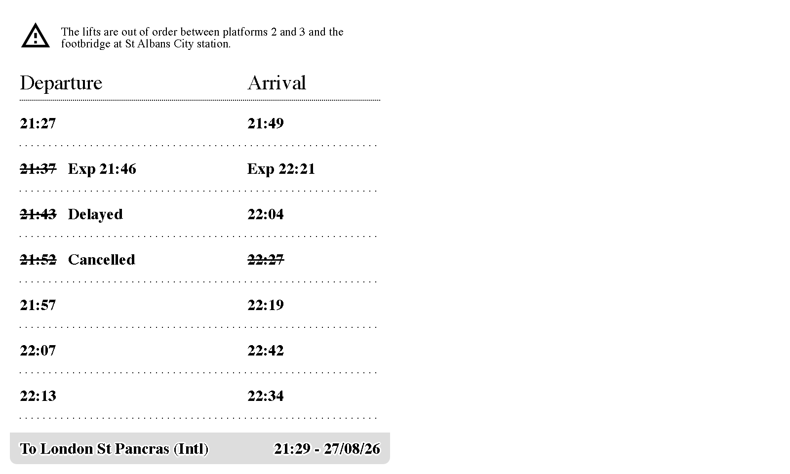
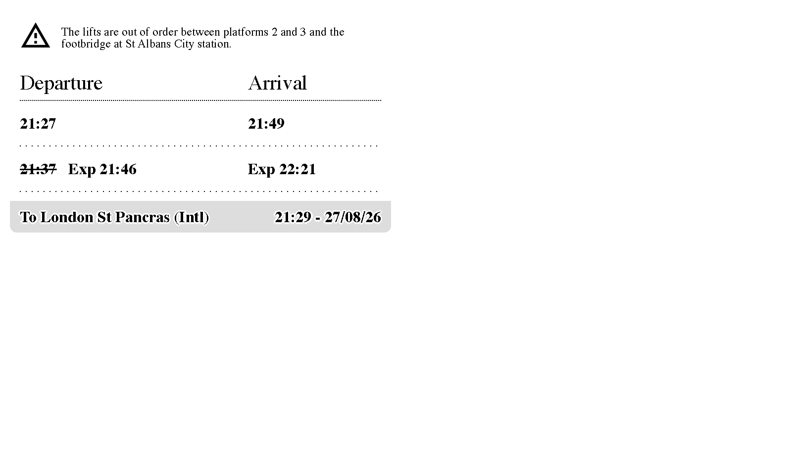

# TRMNL National Rail Departures

A [TRMNL](https://usetrmnl.com) extension to display National Rail departures from a specified station to a target station.



<details>
<summary>Other layouts</summary>

| Half horizontal | Half vertical | Quadrant |
| --- | --- | --- |
|  |  |  |

</details>

## Prerequisites

You'll need:

* An API key for the National Rail Darwin data. Register on the [Rail Data Marketplace](https://raildata.org.uk/), subscribe to the free "Live Departure Board" data product, and copy the **Consumer key** from its Specification tab.
  * The old self-service OpenLDBWS registration at `realtime.nationalrail.co.uk` has been retired, and the legacy SOAP endpoint no longer accepts Marketplace keys — this plugin uses the Marketplace REST API instead.
* The CRS codes for the departure and destination stations, which you can find on [the National Rail website](https://www.nationalrail.co.uk/). e.g. St Pancras is STP; St Albans City is SAC; and so on.
* You may optionally set a threshold for fast trains in the settings. If set, this will flag services to the target station with a duration below that length of time. Leave it blank to hide the marker entirely.

## Display

Each row shows the scheduled departure from your origin and the scheduled arrival at your destination.

* When a service is not on time, the scheduled departure is struck through and the current status follows it — `Exp 21:46`, `Delayed`, or `Cancelled`.
* Cancelled services have both the departure and arrival struck through. A service counts as cancelled if it is cancelled outright, or if your destination has been dropped from its calling points.

The screenshots above show injected disruption data; on a normal day most rows are simply on time.

## Running Locally

You'll need Ruby to run [trmnl-preview](https://github.com/usetrmnl/trmnlp) or Docker.

```bash
NATIONAL_RAIL_API_KEY=<your-api-key-here> bin/trmnlp serve
```

## Attributions

The data feed is [powered by National Rail Enquiries](https://www.nationalrail.co.uk/developers/).

The icon used in the plugin catalogue is [from the Material Design icons](https://github.com/Templarian/MaterialDesign/blob/master/LICENSE).
